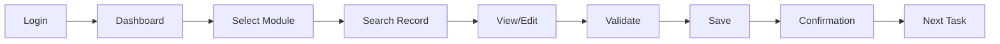

# ModernizeAI — AI-Powered Application Modernization Through Video Intelligence

## Technical Approach Document

| Field | Detail |
|-------|--------|
| **Document Type** | Technical Strategy & Implementation Blueprint |
| **Version** | 1.0 — Draft |
| **Date** | 7 April 2026 |
| **Status** | For Review |

---

## Table of Contents

1. [Executive Summary](#executive-summary)
2. [Solution Overview](#solution-overview)
3. [Phase 1: Video Intelligence Pipeline](#phase-1-video-intelligence-pipeline)
4. [Phase 2: Intelligent Extraction](#phase-2-intelligent-extraction-agentic-core)
5. [Phase 3: Document Generation](#phase-3-document-generation)
6. [Phase 4: Code Generation & Deployment](#phase-4-code-generation--deployment)
7. [Technical Architecture](#technical-architecture)
8. [Agent Architecture: LangGraph State Machine](#agent-architecture-langgraph-state-machine)
9. [Cost Analysis](#cost-analysis)
10. [Implementation Roadmap](#implementation-roadmap)
11. [Risk Assessment & Mitigation](#risk-assessment--mitigation)
12. [Security & Compliance](#security--compliance)
13. [Success Metrics](#success-metrics)
14. [Conclusion & Next Steps](#conclusion--next-steps)

---

## Executive Summary

### The Problem

Enterprise application modernization today relies on lengthy discovery workshops — 5–10 days of consultants sitting with client teams, manually documenting screens, business rules, pain points, and requirements. This process is expensive, error-prone, and doesn't scale. Many public sector organizations and large enterprises have been sitting on 30–40 year old legacy systems (mainframe COBOL, legacy SAP, Oracle Forms) with little or no documentation, making modernization projects risky and time-consuming.

### The Solution

We propose an **AI-powered agentic workflow system** — codenamed **"ModernizeAI"** — that transforms a simple screen recording (with audio commentary) of an existing application into a complete set of modernization deliverables:

1. **Business Requirement Document (BRD)** — current state, pain points, requirements
2. **Functional Design Document (FDD)** — future state design, process flows, gap analysis
3. **UI Wireframes** — visual mockups of the modernized application
4. **Deployable Code** — generated in the client's chosen technology framework

A consultant (or the client) simply records a video walkthrough of their current application while providing verbal commentary about what works, what doesn't, and what they want. **The system does the rest.**

### The Value Proposition

| Traditional Approach | ModernizeAI Approach |
|---------------------|---------------------|
| 5–10 day discovery workshops | 1–2 hour video recording |
| 3–5 consultants on-site | 1 consultant (or self-service) |
| 2–4 weeks for BRD | Same-day BRD generation |
| Manual FDD creation (weeks) | FDD within 24–48 hours |
| Wireframes require UX team | Auto-generated wireframes |
| Code written from scratch | Scaffolded code generation |
| **Total: 3–6 months to first deliverable** | **Total: 1–2 weeks to first deliverable** |

### Target Scenarios

| Scenario | Example |
|----------|---------|
| Mainframe → Modern Cloud | COBOL/CICS/JCL → Next.js + .NET microservices |
| SAP → Oracle (or reverse) | SAP ECC → Oracle Cloud ERP/HCM |
| Oracle Forms → Modern Web | Oracle Forms 6i → React + Spring Boot |
| Custom Legacy → Modern Stack | VB6/PowerBuilder/Delphi → Modern frameworks |
| Platform Upgrade | SAP ECC → SAP S/4HANA |

---

## Solution Overview

### High-Level Workflow

```
┌──────────────────────────────────────────────────────────────────┐
│                     INPUT: Screen Recording                       │
│           (Application walkthrough + Audio commentary)            │
└──────────────────────────┬───────────────────────────────────────┘
                           │
                           ▼
┌──────────────────────────────────────────────────────────────────┐
│              PHASE 1: VIDEO INTELLIGENCE PIPELINE                 │
│                                                                   │
│   ┌─────────────────┐         ┌─────────────────┐               │
│   │  Frame Extractor │         │ Audio Transcriber│               │
│   │  (FFmpeg + Scene │ parallel│ (Whisper API     │               │
│   │   Detection)     │◄───────►│  Speaker-Aware)  │               │
│   └────────┬────────┘         └────────┬────────┘               │
│            │                           │                         │
│            └──────────┬────────────────┘                         │
│                       ▼                                          │
│            ┌─────────────────────┐                               │
│            │ Temporal Alignment   │                               │
│            │ (Visual + Audio Sync)│                               │
│            └──────────┬──────────┘                               │
│                       ▼                                          │
│            ┌─────────────────────┐                               │
│            │ Unified Activity Log │                               │
│            └─────────────────────┘                               │
└──────────────────────────┬───────────────────────────────────────┘
                           │
                           ▼
┌──────────────────────────────────────────────────────────────────┐
│            PHASE 2: INTELLIGENT EXTRACTION                        │
│                                                                   │
│   ┌────────────────┐  ┌──────────────┐  ┌──────────────────┐   │
│   │Current State   │  │Requirement   │  │Domain Knowledge  │   │
│   │Analysis Agent  │──►Extraction    │  │Agent (Mainframe/ │   │
│   │                │  │Agent         │  │SAP/Oracle aware) │   │
│   └────────────────┘  └──────────────┘  └──────────────────┘   │
└──────────────────────────┬───────────────────────────────────────┘
                           │
                           ▼
┌──────────────────────────────────────────────────────────────────┐
│            PHASE 3: DOCUMENT GENERATION                           │
│                                                                   │
│   ┌──────┐    ┌──────┐    ┌───────────┐    ┌──────────────┐    │
│   │ BRD  │───►│ FDD  │───►│ Wireframes│───►│ Code Package │    │
│   │Agent │    │Agent │    │ Agent     │    │ Agent        │    │
│   └──────┘    └──────┘    └───────────┘    └──────────────┘    │
│       ▲           ▲            ▲                 ▲              │
│       └───────────┴────────────┴─────────────────┘              │
│              Human-in-the-Loop Review & Approval                 │
└──────────────────────────┬───────────────────────────────────────┘
                           │
                           ▼
┌──────────────────────────────────────────────────────────────────┐
│                      OUTPUT DELIVERABLES                          │
│                                                                   │
│   📄 BRD    📄 FDD    🖼️ Wireframes    💻 Deployable Code       │
└──────────────────────────────────────────────────────────────────┘
```

---

## Phase 1: Video Intelligence Pipeline

### 1.1 Video Upload & Pre-processing

**Input**: A screen recording (MP4, AVI, MOV, WebM) of a user walking through their current application, with microphone capturing their verbal commentary.

**Processing Steps**:

1. **Upload** via secure web portal (chunked upload for large files, up to 4 hours of video)
2. **Validation**: check video has both video and audio tracks, minimum resolution (720p recommended, 1080p preferred)
3. **Separate tracks**: use FFmpeg to split into visual frames and audio stream
4. **Frame extraction**: extract at adaptive rate using scene-change detection:
   - Static screen (no change): **0.5 FPS** (1 frame per 2 seconds)
   - Active navigation/input: **2 FPS**
   - Screen transition detected: **burst capture** (5 frames in 1 second)
   - This reduces a 1-hour video from 7,200 frames (at 2fps) to **~1,500–2,500 frames**
5. **Frame deduplication**: perceptual hashing (pHash) to skip near-identical consecutive frames — further reduces to **~800–1,200 unique frames**
6. **Audio chunking**: split audio into ≤25MB segments preserving sentence boundaries

### 1.2 Audio Transcription

**Technology**: OpenAI Whisper API — `gpt-4o-transcribe-diarize` model

**Why this model**:

- **Speaker diarization**: automatically identifies different speakers (e.g., "Speaker 1 says...", "Speaker 2 asks...")
- **Word-level timestamps**: precise timing for temporal alignment with frames
- **Confidence scores**: identifies uncertain transcriptions for human review
- **Domain prompting**: feed domain-specific terminology to improve accuracy

**Domain Prompt Examples**:

| Domain | Prompt Additions |
|--------|-----------------|
| Mainframe | CICS, COBOL, JCL, VSAM, DB2, IMS, TSO, ISPF, 3270 terminal, copybook, paragraph, perform |
| SAP | T-code, ABAP, BAPI, RFC, SAP GUI, Fiori, S/4HANA, transport request, IMG, SPRO |
| Oracle | PL/SQL, Oracle Forms, Oracle Reports, concurrent program, responsibility, flexfield, OAF |
| General | workflow, approval chain, validation rule, batch processing, interface, API |

**Output per chunk**:

```json
{
  "segments": [
    {
      "speaker": "Speaker_1",
      "start": 12.45,
      "end": 18.90,
      "text": "So this is our main customer entry screen. The problem is it takes about 30 seconds to load because it's pulling from the mainframe.",
      "words": [
        { "word": "So", "start": 12.45, "end": 12.60, "confidence": 0.98 },
        { "word": "this", "start": 12.62, "end": 12.80, "confidence": 0.99 }
      ]
    }
  ]
}
```

### 1.3 Visual Frame Analysis

**Technology**: OpenAI GPT-4o Vision API (`detail: "high"`)

**What we extract from each frame**:

| Category | Details |
|----------|---------|
| **Screen Identity** | Screen name/title, module, transaction code (if visible) |
| **UI Components** | Buttons, forms, tables, menus, tabs, modals, dropdowns |
| **Visible Text** | Labels, field values, headers, error messages, tooltips |
| **Layout** | Grid structure, navigation bars, sidebars, footer elements |
| **Data Fields** | Input fields with labels, data types inferred, mandatory indicators |
| **State** | Loading indicators, disabled elements, selected tabs, active menu items |
| **Platform Markers** | SAP GUI bar, Oracle toolbar, mainframe terminal style, browser URL |

**Structured Output per Frame**:

```json
{
  "frame_id": "frame_0245",
  "timestamp": 122.5,
  "screen": {
    "title": "Customer Master Maintenance",
    "platform": "mainframe_3270_terminal",
    "module": "Customer Management"
  },
  "ui_elements": [
    { "type": "input_field", "label": "Customer ID", "value": "10045892", "position": "top-left" },
    { "type": "input_field", "label": "Customer Name", "value": "ACME Corp", "position": "top-center" },
    { "type": "button", "label": "SAVE", "state": "enabled", "position": "bottom-right" },
    { "type": "menu", "items": ["File", "Edit", "View", "Actions"], "active": "Actions" }
  ],
  "detected_interaction": "data_entry",
  "screen_transition": false
}
```

### 1.4 Temporal Alignment Engine

This is the critical intelligence layer — it correlates **what the user sees** with **what the user says** at each moment.

**Algorithm**:

1. For each frame at timestamp `T_i`, find all audio words in the window `[T_i - 0.5s, T_i + 0.5s]`
2. Expand the window to the full sentence containing those words
3. Combine visual analysis + audio context into a **unified activity entry**
4. Classify the activity type: `navigation`, `data_entry`, `search`, `approval`, `error_handling`, `explanation`, `complaint`, `requirement_expression`

**Unified Activity Log Entry**:

```json
{
  "activity_id": "ACT_045",
  "timestamp_range": [120.0, 135.5],
  "screen": "Customer Master Maintenance",
  "visual_summary": "User navigating customer fields, entering data, clicking Save button",
  "audio_transcript": "This is where we enter customer details. The problem is there's no validation on the phone number field, so people enter all sorts of garbage. We really need field-level validation here.",
  "classified_intents": [
    { "type": "current_process", "detail": "Customer data entry in Customer Master screen" },
    { "type": "pain_point", "detail": "No validation on phone number field", "severity": "medium" },
    { "type": "requirement", "detail": "Need field-level validation on phone number", "priority": "high" }
  ],
  "business_rule_detected": null,
  "related_activities": ["ACT_043", "ACT_044"]
}
```

---

## Phase 2: Intelligent Extraction (Agentic Core)

We use **LangGraph** (stateful graph-based agent orchestration) with three specialized agents operating on the unified Activity Log.

### 2.1 Current State Analysis Agent

**Purpose**: Build a comprehensive model of the existing application.

**Outputs**:

#### A. Application Screen Inventory

| # | Screen Name | Module | Purpose | Navigation Path | # Fields | Key Actions |
|---|------------|--------|---------|----------------|----------|-------------|
| 1 | Login Screen | Auth | User authentication | Entry point | 3 | Login, Forgot Password |
| 2 | Main Dashboard | Core | Overview | Post-login | 0 | Navigate to modules |
| 3 | Customer Master | CRM | Customer CRUD | Dashboard → Customers | 15 | Create, Edit, Search, Delete |

#### B. Business Process Flows (auto-generated as Mermaid diagrams)



#### C. Data Model (inferred from visible fields)

- **Entity: Customer** — Fields: ID, Name, Address, Phone, Email, Status, Created Date
- **Entity: Order** — Fields: Order#, Customer ID, Product, Quantity, Amount, Status
- **Relationships**: Customer 1→N Orders

#### D. Integration Map

External systems mentioned or visible (APIs, file transfers, batch jobs)

### 2.2 Requirement Extraction Agent

**Purpose**: Extract every requirement, pain point, and business rule from the audio commentary + visual context.

**Classification Framework**:

| Category | Signal Words / Patterns | Example |
|----------|------------------------|---------|
| **Pain Point** | "problem is", "takes too long", "doesn't work", "manual", "error-prone" | "The problem is this report takes 4 hours to run" |
| **Functional Requirement** | "we need", "should be able to", "want to", "must have" | "We need real-time validation on all input fields" |
| **Non-Functional Requirement** | "fast", "available", "secure", "scalable", "SLA" | "The system must be available 99.9% of the time" |
| **Business Rule** | "when", "if...then", "must", "always", "never", "only if" | "When order amount exceeds 10K, manager approval is required" |
| **Compliance** | "audit", "regulation", "compliance", "GDPR", "SOX" | "We need audit trail for all customer data changes" |
| **Integration Need** | "connects to", "sends data to", "receives from", "API" | "This needs to sync with our SAP system every night" |

**Confidence Scoring**: Each requirement gets a confidence score (0–1) based on:

- Clarity of statement (explicit = 0.9+, inferred = 0.5–0.8)
- Number of times mentioned (frequency boosts confidence)
- Corroboration between visual + audio evidence

### 2.3 Domain Knowledge Agent

**Purpose**: Apply platform-specific expertise to enrich analysis.

**Mainframe-Specific Intelligence**:
- Identify CICS transaction IDs from screen headers
- Recognize 3270 terminal screen patterns (green-screen layouts)
- Map COBOL data structures from visible field patterns
- Identify JCL job references from batch processing discussions
- Suggest modern equivalents: CICS → REST APIs, VSAM → PostgreSQL/MongoDB, JCL → orchestration tools

**SAP-Specific Intelligence**:
- Identify T-codes from SAP GUI title bar
- Map to SAP modules (FI, CO, MM, SD, PP, HCM, etc.)
- Recognize custom Z-programs and enhancements
- Identify standard vs custom functionality
- Map to target: SAP ECC → S/4HANA migration paths, or SAP → Oracle Cloud equivalents

**Oracle-Specific Intelligence**:
- Identify Oracle Forms screens, navigation menus
- Recognize Oracle Reports, concurrent program submissions
- Map responsibilities, flexfields, value sets
- Suggest Oracle Cloud equivalents or alternative platform mappings

---

## Phase 3: Document Generation

### 3.1 Business Requirement Document (BRD)

**Generated Structure**:

1. **Executive Summary** — one-page overview of the modernization need
2. **Current State Assessment**
   - Application landscape (from Screen Inventory)
   - Technology stack identified
   - Business processes documented (from Process Flows)
   - User roles and access patterns
3. **Problem Statement**
   - Consolidated pain points (with severity ranking)
   - Current limitations and risks
   - Performance issues
   - Compliance gaps
4. **Business Objectives**
   - What the organization wants to achieve
   - Strategic drivers for modernization
   - Expected outcomes and benefits
5. **Requirement Catalog**
   - Functional Requirements (categorized by module/process)
   - Non-Functional Requirements (performance, security, availability, scalability)
   - Integration Requirements
   - Data Migration Requirements
   - Compliance & Regulatory Requirements
6. **Assumptions & Constraints**
7. **Glossary of Terms**

> **Human Review Gate**: BRD is presented to stakeholders for review and approval before proceeding.

### 3.2 Functional Design Document (FDD)

**Generated Structure** *(depends on BRD approval)*:

1. **Future State Architecture** — proposed solution landscape
2. **Functional Specifications** — per module/screen:
   - Current behavior → Future behavior
   - Field mappings (old → new)
   - Business rule implementation
   - Validation rules
3. **Process Flow Redesign** — optimized workflows (Mermaid/BPMN diagrams)
4. **Data Model Design** — ERD, table structures, relationships
5. **Integration Design** — API specifications, data flow diagrams
6. **Gap Analysis Matrix**:

| Current Feature | Target Solution | Approach | Complexity | Notes |
|----------------|----------------|----------|-----------|-------|
| Customer Search (CICS) | REST API + React UI | Rebuild | Medium | Add fuzzy search |
| Batch Report (JCL) | Real-time Dashboard | Redesign | High | Eliminate batch |
| Manual Approval (Paper) | Digital Workflow | New | Medium | Add email notifications |

7. **Migration Strategy** — phased cutover plan
8. **Risk Assessment**

### 3.3 Wireframe Generation

**For Custom / Bespoke Applications**:
- Generate wireframes as structured HTML/CSS mockups
- Show every screen mapped from the current application
- Apply modern UX patterns (responsive, accessible)
- Map to the selected technology framework's component library
- Generate interactive clickable prototype (optional)

**For Standard Platform Migrations**:
- Generate platform-native screen mockups
- Show standard transaction flows using target platform's UI paradigm
- Identify configurations vs customization needs
- Reference target platform's best practices

### 3.4 Interactive Review Portal

**Critical Human-in-the-Loop Step**: Before proceeding to code generation, all documents are presented for stakeholder review.

**Review Features**:

- Section-by-section approval / rejection
- Inline commenting and change requests
- AI-assisted revision (modify a section → AI regenerates while maintaining consistency)
- Version tracking and comparison
- Multi-stakeholder collaborative review
- Approval workflow: `Draft → Review → Approved → Locked`

---

## Phase 4: Code Generation & Deployment

### 4.1 Framework Selection

| Target Type | Options |
|------------|---------|
| **Frontend** | Next.js, React, Angular, Vue.js, .NET Blazor |
| **Backend** | .NET Core, Spring Boot, Node.js (Express/Fastify), Python (FastAPI/Django) |
| **Database** | PostgreSQL, SQL Server, Oracle DB, MongoDB |
| **Platform** | SAP S/4HANA, Oracle Cloud, Salesforce |
| **Mobile** | React Native, Flutter |

### 4.2 Code Generation Output

For a custom application, the system generates:

```
/generated-project
├── /frontend
│   ├── /components          # UI components matching wireframes
│   ├── /pages               # Route-based pages
│   ├── /services            # API integration layer
│   ├── /types               # TypeScript type definitions
│   └── /tests               # Unit + integration tests
├── /backend
│   ├── /controllers         # API endpoints
│   ├── /services            # Business logic (from business rules)
│   ├── /models              # Database models (from data model)
│   ├── /middleware           # Auth, validation, logging
│   ├── /migrations          # Database schema migrations
│   └── /tests               # API tests
├── /infrastructure
│   ├── docker-compose.yml
│   ├── Dockerfile
│   └── /k8s                 # Kubernetes manifests (optional)
├── /docs
│   ├── BRD.md
│   ├── FDD.md
│   ├── API-specification.yaml
│   └── deployment-guide.md
└── README.md
```

### 4.3 Deployment Readiness Package

- Deployment guide with environment setup
- Test plan with requirements traceability matrix
- Data migration scripts (where applicable)
- Runbooks for operations handover
- Performance benchmarks and SLA targets

---

## Technical Architecture

### System Architecture Diagram

```
┌─────────────────────────────────────────────────────────────────────────┐
│                           CLIENT LAYER                                   │
│                                                                          │
│   ┌──────────────┐  ┌───────────────┐  ┌────────────────────────┐      │
│   │ Upload Portal │  │ Review Portal  │  │ Project Dashboard      │      │
│   │ (Next.js)     │  │ (Next.js)      │  │ (Next.js)              │      │
│   └──────┬───────┘  └───────┬────────┘  └───────────┬────────────┘      │
└──────────┼──────────────────┼───────────────────────┼────────────────────┘
           │                  │                       │
           ▼                  ▼                       ▼
┌─────────────────────────────────────────────────────────────────────────┐
│                           API GATEWAY                                    │
│                    (Azure API Management / Kong)                         │
│                 Authentication: Azure AD / OAuth 2.0                     │
└──────────────────────────────┬──────────────────────────────────────────┘
                               │
┌──────────────────────────────▼──────────────────────────────────────────┐
│                        APPLICATION LAYER                                 │
│                        (Python FastAPI)                                   │
│                                                                          │
│   ┌────────────────────────────────────────────────────────────┐        │
│   │              LangGraph Orchestrator                          │        │
│   │                                                              │        │
│   │   ┌──────────┐    ┌──────────┐    ┌──────────┐             │        │
│   │   │ Video    │    │ Analysis │    │ Extraction│             │        │
│   │   │ Process  │───►│ Node     │───►│ Node     │             │        │
│   │   │ Node     │    │(parallel)│    │          │             │        │
│   │   └──────────┘    └──────────┘    └─────┬────┘             │        │
│   │                                         │                   │        │
│   │   ┌─────────────────────────────────────▼────────────────┐ │        │
│   │   │           CrewAI Document Agents                      │ │        │
│   │   │   BRD Agent → FDD Agent → Wireframe → Code Agent     │ │        │
│   │   └──────────────────────────────────────────────────────┘ │        │
│   └────────────────────────────────────────────────────────────┘        │
└──────────────────────────────┬──────────────────────────────────────────┘
                               │
┌──────────────────────────────▼──────────────────────────────────────────┐
│                         AI SERVICES LAYER                                │
│                                                                          │
│  ┌───────────────────┐  ┌────────────────┐  ┌───────────────────────┐  │
│  │ Azure OpenAI       │  │ OpenAI Whisper  │  │ Azure AI Search       │  │
│  │ GPT-4o (Vision +   │  │ gpt-4o-         │  │ (Vector Store for     │  │
│  │  Text Generation)  │  │ transcribe-     │  │  Domain Knowledge     │  │
│  │                    │  │ diarize         │  │  RAG Retrieval)       │  │
│  └───────────────────┘  └────────────────┘  └───────────────────────┘  │
└─────────────────────────────────────────────────────────────────────────┘
                               │
┌──────────────────────────────▼──────────────────────────────────────────┐
│                          DATA LAYER                                      │
│                                                                          │
│  ┌───────────────────┐  ┌────────────────┐  ┌───────────────────────┐  │
│  │ Azure Blob Storage │  │ PostgreSQL      │  │ Redis                 │  │
│  │ (Videos, Frames,   │  │ (Projects,      │  │ (Task Queue,          │  │
│  │  Artifacts, Docs)  │  │  Metadata,      │  │  Session Cache,       │  │
│  │                    │  │  User State)     │  │  Job Status)          │  │
│  └───────────────────┘  └────────────────┘  └───────────────────────┘  │
└─────────────────────────────────────────────────────────────────────────┘
```

### Technology Stack Summary

| Component | Technology | Justification |
|-----------|-----------|---------------|
| **LLM (Vision + Text)** | Azure OpenAI GPT-4o | Best-in-class multimodal; enterprise-grade Azure hosting; data residency controls |
| **Transcription** | OpenAI Whisper `gpt-4o-transcribe-diarize` | Speaker diarization, word-level timestamps, domain prompting |
| **Agent Orchestration** | LangGraph | Stateful graphs, durable execution (resumes from failures), fine-grained state management |
| **Document Gen Agents** | CrewAI | High-level sequential agent collaboration, built-in memory, production-ready |
| **Vector Store / RAG** | Azure AI Search | Domain knowledge retrieval — mainframe, SAP, Oracle reference patterns |
| **Frontend** | Next.js (React) | Modern SSR/SSG, excellent DX, component ecosystem |
| **Backend API** | Python FastAPI | Async-native, ideal for AI/ML workloads, excellent LangGraph/CrewAI integration |
| **Video Processing** | FFmpeg | Industry standard — frame extraction, audio separation, scene detection |
| **Storage** | Azure Blob Storage | Scalable, secure, CDN-integrated for large video files |
| **Database** | PostgreSQL | Robust relational DB for project metadata, user sessions, approval workflows |
| **Task Queue** | Redis + Celery (or Azure Service Bus) | Async video processing, job management |
| **Authentication** | Azure AD / OAuth 2.0 | Enterprise SSO, RBAC |
| **Deployment** | Azure Kubernetes Service (AKS) | Scalable, container-based deployment |
| **Monitoring** | LangSmith + Application Insights | Agent tracing, performance monitoring, cost tracking |

---

## Agent Architecture: LangGraph State Machine

```
                    ┌─────────────────┐
                    │   START          │
                    │   (Video Upload) │
                    └────────┬────────┘
                             │
                    ┌────────▼────────┐
                    │  PREPROCESS      │
                    │  Split A/V       │
                    │  Extract frames  │
                    └────────┬────────┘
                             │
               ┌─────────────┼─────────────┐
               │             │             │
      ┌────────▼───────┐    │    ┌────────▼───────┐
      │  VISION AGENT   │    │    │  WHISPER AGENT  │
      │  Analyze frames │    │    │  Transcribe     │
      │  GPT-4o Vision  │    │    │  audio          │
      └────────┬───────┘    │    └────────┬───────┘
               │             │             │
               └─────────────┼─────────────┘
                             │
                    ┌────────▼────────┐
                    │  ALIGNMENT       │
                    │  Merge visual +  │
                    │  audio by time   │
                    └────────┬────────┘
                             │
               ┌─────────────┼──────────────┐
               │             │              │
      ┌────────▼────────┐   │   ┌──────────▼──────────┐
      │  CURRENT STATE   │   │   │  DOMAIN KNOWLEDGE    │
      │  AGENT           │   │   │  AGENT (RAG)         │
      └────────┬────────┘   │   └──────────┬──────────┘
               │             │              │
               └─────────────┼──────────────┘
                             │
                    ┌────────▼────────┐
                    │  REQUIREMENT     │
                    │  EXTRACTION      │
                    └────────┬────────┘
                             │
                    ┌────────▼────────┐
                    │  BRD GENERATION  │──── HUMAN REVIEW ◄──┐
                    └────────┬────────┘     (approve/edit)   │
                             │                    │          │
                             │◄───────────────────┘          │
                             │  (if approved)                │
                    ┌────────▼────────┐                      │
                    │  FDD GENERATION  │──── HUMAN REVIEW ────┘
                    └────────┬────────┘
                             │
                    ┌────────▼────────┐
                    │  WIREFRAME GEN   │──── HUMAN REVIEW
                    └────────┬────────┘
                             │
                    ┌────────▼────────┐
                    │  CODE GENERATION │
                    └────────┬────────┘
                             │
                    ┌────────▼────────┐
                    │  END             │
                    │  (Deliverables)  │
                    └─────────────────┘
```

**Key LangGraph Features Used**:

- **State persistence**: entire pipeline state is checkpointed; if a step fails, resume from last checkpoint
- **Human-in-the-loop**: built-in interrupt points for review/approval before proceeding
- **Parallel branches**: vision + transcription run concurrently
- **Conditional routing**: if the user requests only BRD (no code), skip later phases

---

## Cost Analysis

### Per-Project Cost Estimate (1-hour video)

| Component | Calculation | Estimated Cost |
|-----------|------------|----------------|
| Frame extraction + storage | ~1,500 unique frames × 200KB = 300MB | ~$0.05 |
| GPT-4o Vision analysis | ~1,500 frames × ~500 tokens/frame = 750K input tokens | ~$15–20 |
| Whisper transcription | ~60 min audio ÷ 25MB chunks ≈ 8 API calls | ~$3–5 |
| Alignment + extraction (GPT-4o text) | ~200K input + 50K output tokens | ~$5–8 |
| BRD generation | ~100K input + 30K output tokens | ~$3–5 |
| FDD generation | ~150K input + 50K output tokens | ~$5–8 |
| Wireframe generation | ~100K input + 40K output tokens | ~$4–6 |
| Code generation | ~200K input + 100K output tokens | ~$8–12 |
| **Total per project** | | **~$40–65** |

### At Scale

| Volume | Monthly Cost | Revenue Potential (at $5K/assessment) |
|--------|-------------|---------------------------------------|
| 10 projects/month | ~$400–650 | $50,000 |
| 50 projects/month | ~$2,000–3,250 | $250,000 |
| 200 projects/month | ~$8,000–13,000 | $1,000,000 |

---

## Implementation Roadmap

### MVP — Weeks 1–4: Video → BRD

| Week | Tasks | Deliverable |
|------|-------|-------------|
| 1 | Video upload portal, FFmpeg frame/audio extraction, Azure Blob integration | Working upload + processing pipeline |
| 2 | Whisper transcription integration, GPT-4o frame analysis, temporal alignment | Activity Log generation from any video |
| 3 | Current State Agent, Requirement Extraction Agent, Domain Knowledge Agent (mainframe focus) | Structured requirement output |
| 4 | BRD generation agent, review UI, end-to-end testing with sample mainframe video | **Demo: Video → BRD** |

### Phase 2 — Weeks 5–8: FDD + Wireframes

| Week | Tasks | Deliverable |
|------|-------|-------------|
| 5 | FDD generation agent, process flow diagram generation (Mermaid) | Auto-generated FDD |
| 6 | Gap analysis matrix, migration strategy recommendations | Complete FDD with gap analysis |
| 7 | Wireframe generation (HTML/CSS mockups), framework mapping | Visual wireframes |
| 8 | Interactive review portal (comments, approvals, revisions), SAP/Oracle domain agents | **Demo: Complete BRD → FDD → Wireframes** |

### Phase 3 — Weeks 9–12: Code Generation + End-to-End

| Week | Tasks | Deliverable |
|------|-------|-------------|
| 9 | Code generation agent — frontend scaffolding, component generation | Working frontend code |
| 10 | Code generation — backend APIs, database schemas, business logic | Full-stack code output |
| 11 | Platform-specific generation (SAP config, Oracle setup), deployment package | Platform migration support |
| 12 | End-to-end integration testing, performance optimization, demo prep | **Demo: Video → Deployable Solution** |

### Phase 4 — Weeks 13–16: Productization

| Week | Tasks | Deliverable |
|------|-------|-------------|
| 13 | Multi-tenant architecture, RBAC, project management | Enterprise-ready backend |
| 14 | Analytics dashboard, cost estimation, project tracking | Management visibility |
| 15 | Template library (common modernization patterns), knowledge base | Accelerated processing |
| 16 | Client-facing portal, documentation, training materials | **Production Launch** |

---

## Risk Assessment & Mitigation

| # | Risk | Impact | Probability | Mitigation |
|---|------|--------|------------|------------|
| 1 | Poor video/audio quality degrades analysis | High | Medium | Provide recording guidelines; min 720p, external mic recommended; AI quality scoring on upload with feedback |
| 2 | Incomplete verbal commentary (user skips key screens) | High | High | AI infers from visual context + flags gaps; generate "clarification questions" doc for follow-up |
| 3 | Deep business logic not visible in UI (batch jobs, backend rules) | Medium | High | Support supplementary inputs: code files, config exports, database schemas as additional uploads |
| 4 | GPT-4o misinterprets complex UI layouts | Medium | Medium | Use `detail: "high"` mode; platform-specific prompt templates; human review catches errors |
| 5 | High token cost for very long videos (4+ hours) | Medium | Low | Adaptive frame rate, deduplication, caching; cost estimate shown before processing |
| 6 | Generated documents miss domain nuances | High | Medium | Mandatory human review gate; confidence scores; domain knowledge RAG from curated knowledge base |
| 7 | Data security — client screenshots contain sensitive data | Critical | High | Azure private endpoints, encryption at rest/transit, auto-PII redaction, data retention policies, SOC2 |
| 8 | LLM hallucination in generated requirements | High | Medium | Every requirement traced to source (timestamp + frame); confidence scoring; no "invented" features |

---

## Security & Compliance

| Aspect | Approach |
|--------|---------|
| **Data Encryption** | AES-256 at rest, TLS 1.3 in transit |
| **PII Detection** | Auto-detect and flag PII in screenshots (names, SSNs, account numbers); option to redact before AI processing |
| **Access Control** | Azure AD SSO, role-based access (Admin, Consultant, Reviewer, Viewer) |
| **Data Residency** | Azure region selection per project; no cross-border data transfer without consent |
| **Audit Trail** | Every AI decision logged with input/output, timestamp, model version |
| **Data Retention** | Configurable retention policies; auto-delete after project completion (30/60/90 days) |
| **Compliance** | SOC2 Type II ready architecture; GDPR-compliant data handling |

---

## Success Metrics

| Metric | Target (MVP) | Target (Production) |
|--------|-------------|-------------------|
| Video → BRD generation time | < 2 hours | < 30 minutes |
| Requirement capture accuracy | > 80% (vs manual workshop) | > 90% |
| BRD completeness score | > 75% (needs < 25% human additions) | > 90% |
| Cost per assessment | < $100 | < $65 |
| Client satisfaction | N/A (internal pilot) | > 4.2/5.0 |
| Supported platforms | Mainframe only | Mainframe + SAP + Oracle + Custom |

---

## Conclusion & Next Steps

ModernizeAI represents a paradigm shift in application modernization — replacing weeks of manual workshops with an AI-powered pipeline that delivers structured, auditable, and actionable deliverables from a simple video recording.

### Immediate Next Steps

1. **Approve** this technical approach
2. **Set up** Azure OpenAI + development environment
3. **Record** a sample mainframe application walkthrough video (15–20 min) for MVP testing
4. **Begin Sprint 1**: video processing pipeline

### The Pitch

> *"What you have been sitting on for 30–40 years, in the next three months we'll transform your entire solution. Record a walkthrough video of your application today — we'll deliver your complete modernization blueprint by next week."*

---

**End of Document**
